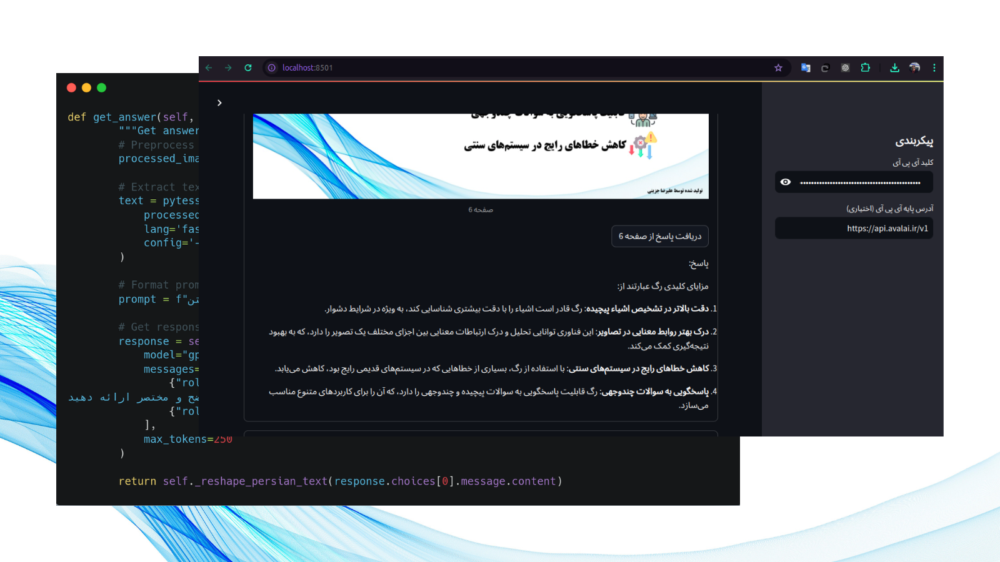

# Persian Document Q&A System

A sophisticated document retrieval and question-answering system specifically designed for Persian (Farsi) documents. This application combines advanced OCR capabilities with modern language models to provide intelligent search and Q&A functionality for Persian PDF documents.




## 🌟 Key Features

- RTL (Right-to-Left) support optimized for Persian text
- PDF document processing with advanced OCR capabilities
- Intelligent semantic search using embeddings
- Interactive Q&A system powered by GPT-4
- Streamlit-based user interface with complete Persian localization
- FAISS-powered similarity search for fast retrieval
- Proper handling of Persian text reshaping and bidirectional text

## 🛠️ Technical Stack

- **Frontend**: Streamlit
- **OCR Engine**: Pytesseract with Persian language support
- **Embeddings**: OpenAI API (text-embedding-3-small)
- **Vector Search**: FAISS
- **Language Model**: GPT-4
- **PDF Processing**: pdf2image
- **Persian Text Processing**: arabic-reshaper, python-bidi

## 📋 Prerequisites

- Python 3.8+
- Tesseract OCR with Persian language support
- Poppler (for PDF processing)
- OpenAI API key

## 🚀 Installation

1. Clone the repository:
```bash
git clone https://github.com/jazini0alireza/persian-document-qa
cd persian-document-qa
```

2. Create a virtual environment and activate it:
```bash
python -m venv venv
source venv/bin/activate  # On Windows: venv\Scripts\activate
```

3. Install the required packages:
```bash
pip install -r requirements.txt
```

4. Install Tesseract OCR and Persian language support:
```bash
# Ubuntu/Debian
sudo apt-get install tesseract-ocr
sudo apt-get install tesseract-ocr-fas

# Windows
# Download and install Tesseract OCR from https://github.com/UB-Mannheim/tesseract/wiki
# Download Persian language data and place in Tesseract installation directory
```

## 💻 Usage

1. Start the application:
```bash
streamlit run main.py
```

2. Enter your OpenAI API key in the sidebar
3. Upload a Persian PDF document
4. Enter your query in Persian
5. View results and get AI-powered answers

## 🎯 Configuration

The application supports several configuration options:

- Custom OpenAI API base URL
- Poppler path configuration
- OCR parameters customization
- UI language customization


## 📝 License

MIT License

## 🤝 Contributing

Contributions are welcome! Please feel free to submit a Pull Request.

1. Fork the repository
2. Create your feature branch (`git checkout -b feature/AmazingFeature`)
3. Commit your changes (`git commit -m 'Add some AmazingFeature'`)
4. Push to the branch (`git push origin feature/AmazingFeature`)
5. Open a Pull Request

## 📞 Support

If you have any questions or run into issues, please open an issue in the GitHub repository.